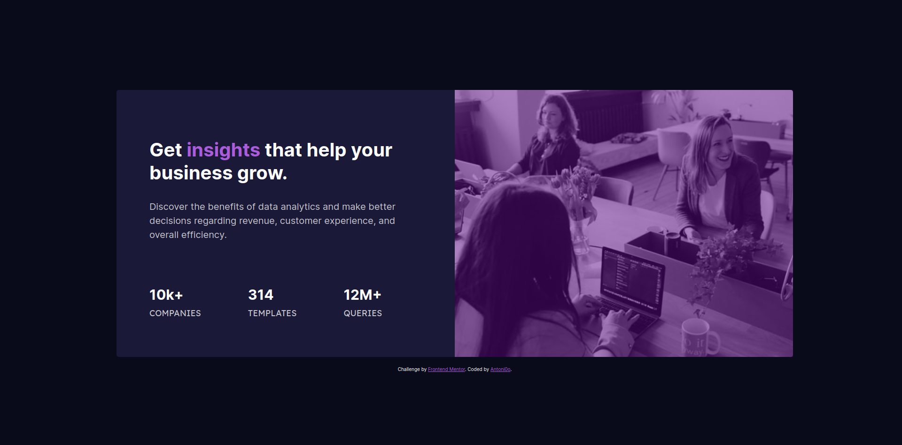
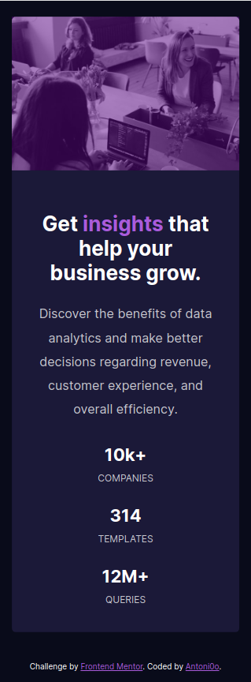

# Frontend Mentor - Stats preview card component solution

This is a solution to the [Stats preview card component challenge on Frontend Mentor](https://www.frontendmentor.io/challenges/stats-preview-card-component-8JqbgoU62). Frontend Mentor challenges help you improve your coding skills by building realistic projects. 

## Table of contents

- [Overview](#overview)
  - [The challenge](#the-challenge)
  - [Screenshot](#screenshot)
  - [Links](#links)
- [My process](#my-process)
  - [Built with](#built-with)
  - [What I learned](#what-i-learned)
  - [Continued development](#continued-development)
- [Author](#author)
- [Acknowledgments](#acknowledgments)

## Overview

### The challenge

Users should be able to:

- View the optimal layout depending on their device's screen size

### Screenshot




### Links

- Solution URL: [Add solution URL here](https://your-solution-url.com)
- Live Site URL: [Add live site URL here](https://your-live-site-url.com)

## My process

### Built with

- Semantic HTML5 markup
- CSS
- Flexbox
- [Vue](https://vuejs.org/) - JS framework

### What I learned

```css
section #image {
    position: relative;
    
    background-image: url(/images/image-header.jpg);
    background-repeat: no-repeat;
    background-size: cover;

    border-radius: 0 0.5rem 0.5rem 0; 
  }


  section #image::after {
    content: "";
    
    position: absolute;
    width: 100%;
    height: 100%;

    background-color: #5d0788;
    opacity: 0.5;
    
    overflow: hidden;
  } 
```


### Continued development

I want to continue focusing on VueJS. In the nexts challenges I'll use more components and others Vue tools.


## Author

- GitHub - [@Antoni0o](https://www.github.com/Antoni0o)
- Frontend Mentor - [@Antoni0o](https://www.frontendmentor.io/profile/Antoni0o)


## Acknowledgments

With this challenge, I learned more about Vue, it's my first project using Vue, so I used it to pratice my design skills.
